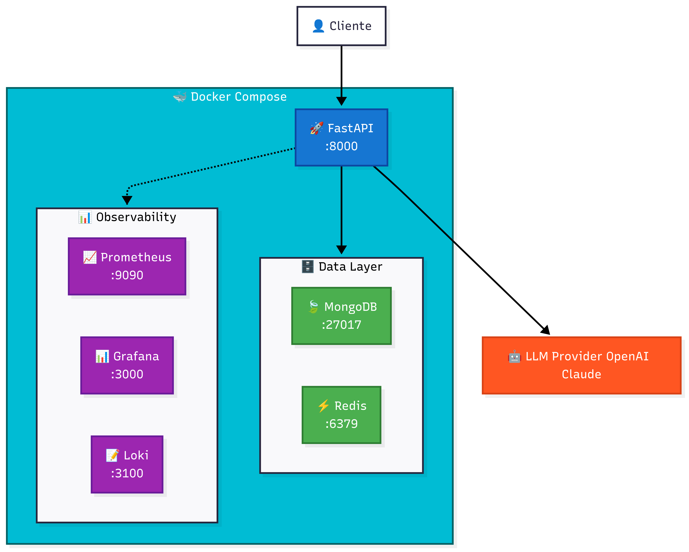
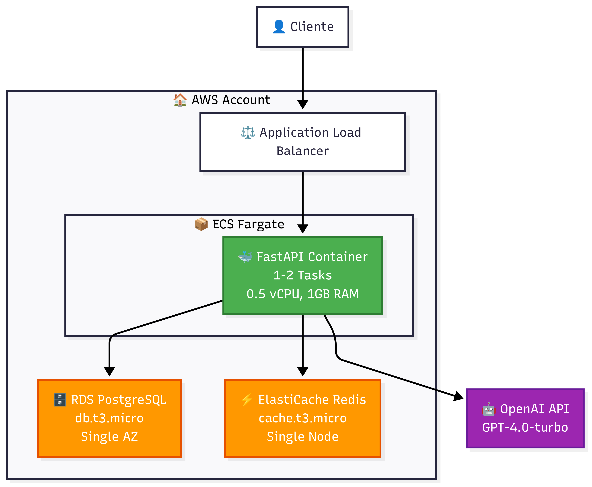
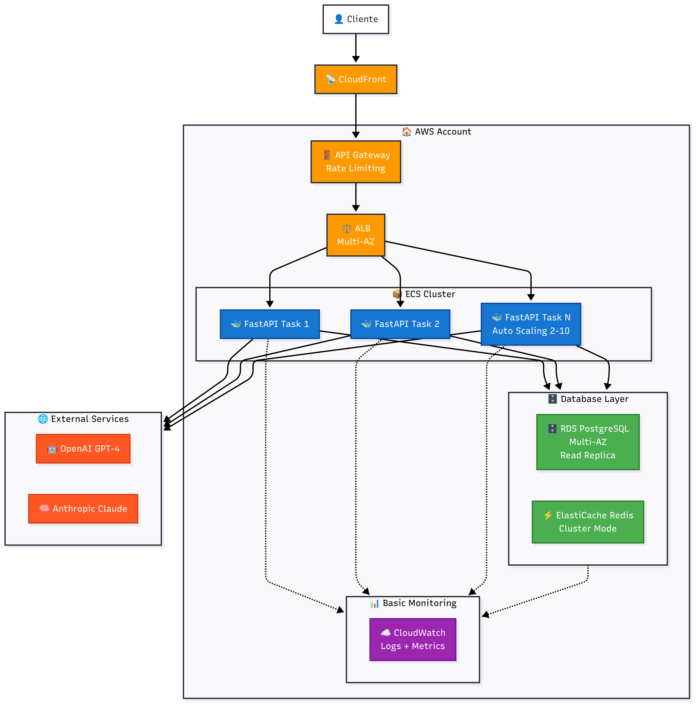
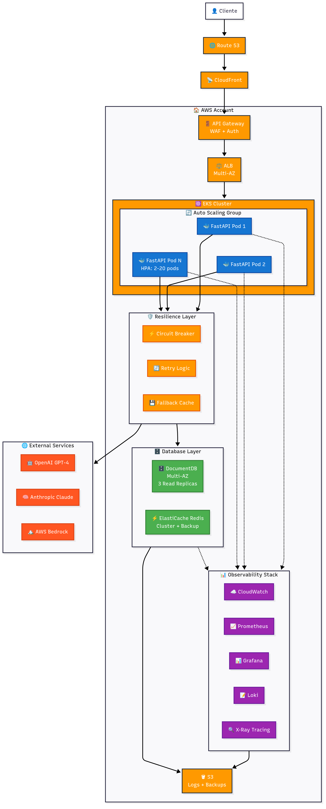
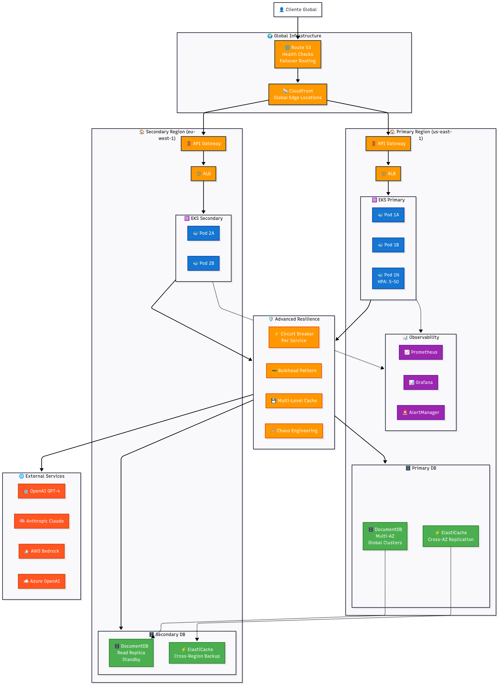

# 🚀 API Chat LLM - Evolução da Arquitetura

Uma API de chat com IA que mostra como evoluir de um MVP simples até uma arquitetura empresarial robusta.

## 📋 Sobre o Projeto

Este projeto demonstra **4 versões diferentes** da mesma API de chat, cada uma adequada para diferentes momentos de uma empresa:

- 🎯 **V1**: MVP para validar a ideia
- 📈 **V2**: Versão escalável para crescimento
- 🏢 **V3**: Arquitetura empresarial completa
- 🛡️ **V4**: Sistema mission-critical

---

## 🏗️ Solução Implementada

Este projeto implementa uma **API de Chat com IA** usando **FastAPI** e **Docker**, demonstrando como uma arquitetura pode evoluir de forma incremental conforme as necessidades do negócio crescem.

### 🎯 **Arquitetura Atual Implementada**

A versão implementada representa um **MVP robusto** (entre V1 e V2), ideal para validação de produto com capacidade de crescimento:



### 🔧 **Componentes da Solução**

#### **🚀 API FastAPI (Porta 8000)**
- **Framework**: FastAPI com Python 3.10+
- **Funcionalidades**:
  - Chat inteligente com múltiplos provedores de IA
  - Rate limiting para controle de uso
  - Health checks e métricas
  - Documentação automática (Swagger)

#### **🗄️ Camada de Dados**
- **MongoDB (Porta 27017)**: Banco NoSQL para armazenar conversas e sessões
- **Redis (Porta 6379)**: Cache em memória para:
  - Sessions de usuários
  - Cache de respostas frequentes
  - Rate limiting

#### **🤖 Provedores de IA**
- **OpenAI/Claude**: Integração com múltiplos provedores
- **Circuit Breaker**: Failover automático entre provedores
- **Retry Logic**: Tentativas automáticas em caso de falha

#### **📊 Observabilidade**
- **Prometheus (Porta 9090)**: Coleta de métricas de performance
- **Grafana (Porta 3000)**: Dashboards visuais para monitoramento
- **Loki (Porta 3100)**: Agregação centralizada de logs

### 🏛️ **Arquitetura de Software**

```
app/
├── core/           # Configurações centrais
├── middleware/     # Rate limiting, auth, métricas
├── models/         # Modelos de dados (Pydantic)
├── routers/        # Endpoints organizados por versão
├── services/       # Lógica de negócio e integrações
```

### 🔑 **Principais Características**

#### **✅ Funcionalidades Implementadas:**
- 🎯 **Chat Inteligente**: Conversas com IA
- ⚡ **Rate Limiting**: Controle de uso por usuário
- 🏥 **Health Checks**: Monitoramento de saúde dos serviços
- 📈 **Métricas**: Observabilidade completa com Prometheus/Grafana
- 🔄 **Circuit Breaker**: Failover automático entre provedores IA
- 💾 **Persistência**: Armazenamento de conversas e sessões
- 📚 **Documentação**: Swagger UI automático

#### **🛡️ Resiliência:**
- **Retry Logic**: Tentativas automáticas em falhas temporárias
- **Circuit Breaker**: Proteção contra cascata de falhas
- **Health Checks**: Detecção proativa de problemas
- **Graceful Shutdown**: Encerramento seguro dos serviços

#### **📊 Observabilidade:**
- **Logs Estruturados**: JSON logs com contexto completo
- **Métricas Customizadas**: Latência, throughput, erros
- **Dashboards**: Visualização em tempo real
- **Alertas**: Notificações automáticas (configuráveis)

### 🎨 **Para executar a aplicação**

Para ver os diagramas interativos e testar a API:
```bash
# Execute a aplicação
docker-compose up --build -d
```

**🌐 Acesse:**
- **API**: http://localhost:8000
- **Documentação**: http://localhost:8000/docs
- **Grafana**: http://localhost:3000 (admin/admin)
- **Prometheus**: http://localhost:9090

---

## 🏗️ As 4 Fases da Evolução

### 📱 **Fase 1: MVP Simples**
> *"Vamos validar se nossa ideia funciona"*



**🎯 Objetivo:** Colocar algo no ar rapidamente e com baixo custo

**👥 Usuários:** Até 100 simultâneos

**🔧 O que tem:**
- 1 servidor simples (ECS Fargate)
- 1 banco de dados (PostgreSQL)
- 1 cache (Redis)
- 1 provedor de IA (OpenAI)

**✅ Vantagens:**
- Rápido para desenvolver
- Barato para manter
- Fácil de entender e debugar

**❌ Problemas:**
- Se o banco cair, tudo para
- Não aguenta muitos usuários
- Sem backup automático

**🚨 Pontos de Falha:**
- Banco em uma zona só (se cair, fica fora do ar)
- Cache sem backup (perde tudo se reiniciar)
- Só um provedor de IA (se OpenAI estiver fora, API para)

---

### 🚀 **Fase 2: Escalável**
> *"Temos usuários! Precisamos aguentar o crescimento"*



**🎯 Objetivo:** Crescer sem quebrar, mas ainda controlando custos

**👥 Usuários:** 100-1.000 simultâneos

**🔧 O que mudou:**
- Vários servidores que aumentam sozinhos
- Banco em várias zonas (mais seguro)
- Cache com backup
- 2 provedores de IA (OpenAI + Claude)
- CDN para ser mais rápido globalmente

**✅ Melhorias:**
- Aguenta picos de usuários
- Se uma zona da AWS cair, continua funcionando
- Mais rápido para usuários de outros países
- Limites de uso para não quebrar

**❌ Ainda tem problemas:**
- Custo começando a subir
- Mais complexo para gerenciar
- Ainda pode ter algumas quedas

---

### 🏢 **Fase 3: Empresarial**
> *"Agora é sério. Precisamos de 99.9% de disponibilidade"*



**🎯 Objetivo:** Produção empresarial com monitoramento completo

**👥 Usuários:** 1.000-10.000 simultâneos

**🔧 O que mudou:**
- Kubernetes para gerenciar tudo automaticamente
- 3 provedores de IA com troca automática
- Monitoramento completo (métricas, logs, alertas)
- Banco NoSQL mais flexível (DocumentDB)
- Sistema que "se conserta sozinho"

**✅ Benefícios:**
- 99.9% de disponibilidade (menos de 9h paradas no ano)
- Se um provedor de IA falhar, troca automático
- Alertas antes dos problemas acontecerem
- Dados salvos em múltiplos lugares

**❌ Desafios:**
- Custo alto
- Precisa de pessoas especializadas
- Muito mais complexo

---

### 🛡️ **Fase 4: Mission Critical**
> *"Cada minuto offline custa milhares. Zero tolerância a falhas"*



**🎯 Objetivo:** Máxima disponibilidade com redundância global

**👥 Usuários:** 10.000+ simultâneos

**🔧 O que mudou:**
- Funcionando em 2 continentes diferentes
- Se uma região inteira da AWS cair, a outra assume
- 4 provedores de IA distribuídos globalmente
- Latência baixa no mundo todo
- Teste automático de falhas (Chaos Engineering)

**✅ O máximo:**
- 99.99% disponibilidade (4 minutos parados no ano todo)
- Funciona mesmo se um país inteiro ficar sem internet
- Resposta rápida em qualquer lugar do mundo
- Se detectar problema, resolve antes afetar usuários

**❌ O preço:**
- Muito caro
- Extremamente complexo
- Precisa de time dedicado só para manter funcionando

---

## 🤔 Quando Usar Cada Versão?

### 💡 **Use V1 quando:**
- Você está testando uma ideia nova
- Tem poucos usuários (menos de 100)
- Budget limitado (menos de $500/mês)
- Time pequeno (1-2 pessoas)

### 📈 **Migre para V2 quando:**
- Começar a ter usuários regulares
- Latência ficar alta (mais de 5 segundos)
- Usuários reclamarem de instabilidade
- Crescendo 20%+ ao mês

### 🏢 **Evolua para V3 quando:**
- Assinaram contrato com SLA (garantia de funcionamento)
- Perder clientes por causa de quedas
- Precisar de relatórios e compliance
- Time cresceu e pode gerenciar complexidade

### 🛡️ **Considere V4 apenas quando:**
- Cada hora parada custa +$10.000
- Atende setores críticos (banco, saúde, emergência)
- Competindo com gigantes da tecnologia
- Tem time especializado (15+ pessoas)

---

## 📊 Resumo dos Tradeoffs

| Aspecto               | V1: MVP  | V2: Escalável | V3: Empresarial | V4: Mission Critical |
| --------------------- | -------- | ------------- | --------------- | -------------------- |
| 📈 **Disponibilidade** | ~95%     | ~99%          | 99.9%           | 99.99%               |
| 👥 **Usuários**        | <100     | 100-1K        | 1K-10K          | 10K+                 |
| 🔧 **Complexidade**    | Baixa    | Média         | Alta            | Muito Alta           |

---

## 📚 Recursos Adicionais

- **Métricas**: `/metrics` (Prometheus)
- **Health Check**: `/v1/health`
- **Documentação API**: `/docs` (Swagger)

---

## 🤝 Contribuindo

Neste projeto é demonstrado boas práticas de evolução arquitetural.

**Pontos de aprendizado:**
- Como balancear custo vs. confiabilidade
- Quando vale a pena adicionar complexidade
- Como identificar e eliminar pontos únicos de falha
- Estratégias de migração sem downtime
---
