# 🚀 API Chat LLM - Evolução da Arquitetura

Uma API de chat com IA que mostra como evoluir de um MVP simples até uma arquitetura empresarial robusta.

## 📋 Sobre o Projeto

Este projeto demonstra **4 versões diferentes** da mesma API de chat, cada uma adequada para diferentes momentos da empresa:

- 🎯 **V1**: MVP para validar a ideia
- 📈 **V2**: Versão escalável para crescimento
- 🏢 **V3**: Arquitetura empresarial completa
- 🛡️ **V4**: Sistema mission-critical

## 🎨 Para executar a aplicação basta utilizar o comando abaixo

Para ver os diagramas interativos e comparar as versões, acesse:
```bash
# Execute a aplicação
docker-compose up --build -d
```
---

## 🏗️ As 4 Fases da Evolução

### 📱 **Fase 1: MVP Simples**
> *"Vamos validar se nossa ideia funciona"*



**🎯 Objetivo:** Colocar algo no ar rapidamente e com baixo custo

**💰 Custo:** ~$150/mês
**⏱️ Tempo:** 2-3 dias
**👥 Usuários:** Até 100 simultâneos

**🔧 O que tem:**
- 1 servidor simples (ECS Fargate)
- 1 banco de dados (PostgreSQL)
- 1 cache (Redis)
- 1 provedor de IA (OpenAI)

**✅ Vantagens:**
- Rápido para desenvolver
- Barato para manter
- Fácil de entender e debugar

**❌ Problemas:**
- Se o banco cair, tudo para
- Não aguenta muitos usuários
- Sem backup automático

**🚨 Pontos de Falha:**
- Banco em uma zona só (se cair, fica fora do ar)
- Cache sem backup (perde tudo se reiniciar)
- Só um provedor de IA (se OpenAI estiver fora, API para)

---

### 🚀 **Fase 2: Escalável**
> *"Temos usuários! Precisamos aguentar o crescimento"*



**🎯 Objetivo:** Crescer sem quebrar, mas ainda controlando custos

**💰 Custo:** ~$800/mês  
**⏱️ Tempo:** 1-2 semanas  
**👥 Usuários:** 100-1.000 simultâneos

**🔧 O que mudou:**
- Vários servidores que aumentam sozinhos
- Banco em várias zonas (mais seguro)
- Cache com backup
- 2 provedores de IA (OpenAI + Claude)
- CDN para ser mais rápido globalmente

**✅ Melhorias:**
- Aguenta picos de usuários
- Se uma zona da AWS cair, continua funcionando
- Mais rápido para usuários de outros países
- Limites de uso para não quebrar

**❌ Ainda tem problemas:**
- Custo começando a subir
- Mais complexo para gerenciar
- Ainda pode ter algumas quedas

---

### 🏢 **Fase 3: Empresarial**
> *"Agora é sério. Precisamos de 99.9% de disponibilidade"*



**🎯 Objetivo:** Produção empresarial com monitoramento completo

**💰 Custo:** ~$3.000/mês  
**⏱️ Tempo:** 2-3 semanas  
**👥 Usuários:** 1.000-10.000 simultâneos

**🔧 O que mudou:**
- Kubernetes para gerenciar tudo automaticamente
- 3 provedores de IA com troca automática
- Monitoramento completo (métricas, logs, alertas)
- Banco NoSQL mais flexível (DocumentDB)
- Sistema que "se conserta sozinho"

**✅ Benefícios:**
- 99.9% de disponibilidade (menos de 9h paradas no ano)
- Se um provedor de IA falhar, troca automático
- Alertas antes dos problemas acontecerem
- Dados salvos em múltiplos lugares

**❌ Desafios:**
- Custo alto
- Precisa de pessoas especializadas
- Muito mais complexo

---

### 🛡️ **Fase 4: Mission Critical**
> *"Cada minuto offline custa milhares. Zero tolerância a falhas"*



**🎯 Objetivo:** Máxima disponibilidade com redundância global

**💰 Custo:** ~$15.000/mês  
**⏱️ Tempo:** 1-2 meses  
**👥 Usuários:** 10.000+ simultâneos

**🔧 O que mudou:**
- Funcionando em 2 continentes diferentes
- Se uma região inteira da AWS cair, a outra assume
- 4 provedores de IA distribuídos globalmente
- Latência baixa no mundo todo
- Teste automático de falhas (Chaos Engineering)

**✅ O máximo:**
- 99.99% disponibilidade (4 minutos parados no ano todo)
- Funciona mesmo se um país inteiro ficar sem internet
- Resposta rápida em qualquer lugar do mundo
- Se detectar problema, resolve antes afetar usuários

**❌ O preço:**
- Muito caro
- Extremamente complexo
- Precisa de time dedicado só para manter funcionando

---

## 🤔 Quando Usar Cada Versão?

### 💡 **Use V1 quando:**
- Você está testando uma ideia nova
- Tem poucos usuários (menos de 100)
- Budget limitado (menos de $500/mês)
- Time pequeno (1-2 pessoas)

### 📈 **Migre para V2 quando:**
- Começar a ter usuários regulares
- Latência ficar alta (mais de 5 segundos)
- Usuários reclamarem de instabilidade
- Crescendo 20%+ ao mês

### 🏢 **Evolua para V3 quando:**
- Assinaram contrato com SLA (garantia de funcionamento)
- Perder clientes por causa de quedas
- Precisar de relatórios e compliance
- Time cresceu e pode gerenciar complexidade

### 🛡️ **Considere V4 apenas quando:**
- Cada hora parada custa +$10.000
- Atende setores críticos (banco, saúde, emergência)
- Competindo com gigantes da tecnologia
- Tem time especializado (15+ pessoas)

---

## 📊 Resumo dos Tradeoffs

| Aspecto               | V1: MVP  | V2: Escalável | V3: Empresarial | V4: Mission Critical |
| --------------------- | -------- | ------------- | --------------- | -------------------- |
| 💰 **Custo/mês**       | $150     | $800          | $3.000          | $15.000              |
| ⏱️ **Tempo setup**     | 2-3 dias | 1-2 sem       | 2-3 sem         | 1-2 meses            |
| 📈 **Disponibilidade** | ~95%     | ~99%          | 99.9%           | 99.99%               |
| 👥 **Usuários**        | <100     | 100-1K        | 1K-10K          | 10K+                 |
| 🔧 **Complexidade**    | Baixa    | Média         | Alta            | Muito Alta           |
| 👨‍💻 **Time necessário** | 1-2 devs | 2-5 devs      | 5-15 devs       | 15+ devs             |

---

## 🎯 Estratégia Recomendada

**🚀 Comece sempre com V1** e evolua conforme a necessidade:

1. **V1 → V2**: Quando atingir 50+ usuários ativos diários
2. **V2 → V3**: Quando precisar de SLA contratual ou compliance
3. **V3 → V4**: Apenas se downtime custar mais que $10k/hora

**⚠️ Sinais de que precisa evoluir:**
- **V1→V2**: Sistema lento ou fora do ar frequentemente
- **V2→V3**: Clientes exigindo garantias contratuais
- **V3→V4**: Multas regulatórias ou perda de receita significativa

---

## 🛠️ Como Executar

```bash
# Instalar dependências
make install

# Subir em modo desenvolvimento
make dev

# Subir em modo produção (Docker)
make run

# Ver métricas
make monitoring

# Executar testes
make test
```

---

## 🎨 Comparação Visual das Arquiteturas

### Evolução Completa: Do MVP ao Mission Critical

| **V1: MVP Simples** | **V2: Escalável** |
|:---:|:---:|
|  |  |
| **V3: Empresarial** | **V4: Mission Critical** |
|  |  |

---

## 📚 Recursos Adicionais

- **Diagramas Interativos**: `/v1/chat/arquitetura`
- **Métricas**: `/metrics` (Prometheus)
- **Health Check**: `/v1/health`
- **Documentação API**: `/docs` (Swagger)

---

## 🤝 Contribuindo

Este projeto é educacional e demonstra boas práticas de evolução arquitetural. 

**Pontos de aprendizado:**
- Como balancear custo vs. confiabilidade
- Quando vale a pena adicionar complexidade
- Como identificar e eliminar pontos únicos de falha
- Estratégias de migração sem downtime

---

*💡 Lembre-se: A melhor arquitetura é a que resolve seu problema atual, não a mais avançada tecnicamente.*